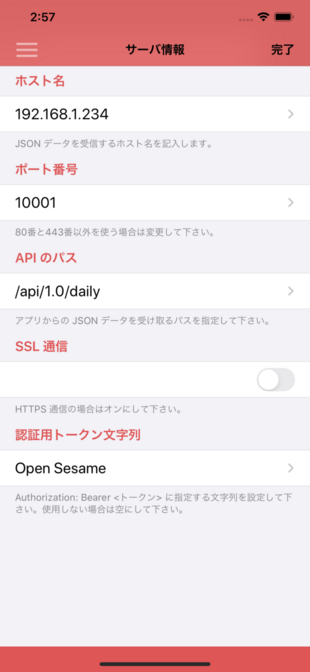

# HealthCareServer

[まいにち体調管理](https://apps.apple.com/jp/app/id1520936281?mt=8&uo=4)
アプリの JSON データを受信する API サーバのサンプル版ソースコードです。

## 使いかた

アプリのサーバ情報画面で __config.js__ 内の値を設定します。

- ホスト名には、サーバを起動する IP アドレスを記入します。
- ポート番号には __port__ の値を設定します。
- API のパスには __endpoint__ の値を設定します。
- 認証用トークン文字列には __accessToken__ の値を設定します。

## サーバの起動

`npm install` してから `npm start` で実行できます。

### JSON データの保存先

config.js の __storage__ に指定したディレクトリに、アプリから受信した JSON データをそのまま保存します。

## アプリから送信

チェック画面の右上のアイコンをタップして、「全データを JSON 形式で送信」を選択します。

## ライセンス

Copyright (c) 2020, Kouichi ABE (WALL) All rights reserved.

Redistribution and use in source and binary forms, with or without
modification, are permitted provided that the following conditions are met:

 1. Redistributions of source code must retain the above copyright notice,
    this list of conditions and the following disclaimer.

 2. Redistributions in binary form must reproduce the above copyright notice,
    this list of conditions and the following disclaimer in the documentation
    and/or other materials provided with the distribution.

THIS SOFTWARE IS PROVIDED BY THE COPYRIGHT HOLDERS AND CONTRIBUTORS "AS IS"
AND ANY EXPRESS OR IMPLIED WARRANTIES, INCLUDING, BUT NOT LIMITED TO, THE
IMPLIED WARRANTIES OF MERCHANTABILITY AND FITNESS FOR A PARTICULAR PURPOSE ARE
DISCLAIMED. IN NO EVENT SHALL THE COPYRIGHT HOLDER OR CONTRIBUTORS BE LIABLE
FOR ANY DIRECT, INDIRECT, INCIDENTAL, SPECIAL, EXEMPLARY, OR CONSEQUENTIAL
DAMAGES (INCLUDING, BUT NOT LIMITED TO, PROCUREMENT OF SUBSTITUTE GOODS OR
SERVICES; LOSS OF USE, DATA, OR PROFITS; OR BUSINESS INTERRUPTION) HOWEVER
CAUSED AND ON ANY THEORY OF LIABILITY, WHETHER IN CONTRACT, STRICT LIABILITY,
OR TORT (INCLUDING NEGLIGENCE OR OTHERWISE) ARISING IN ANY WAY OUT OF THE USE
OF THIS SOFTWARE, EVEN IF ADVISED OF THE POSSIBILITY OF SUCH DAMAGE.
